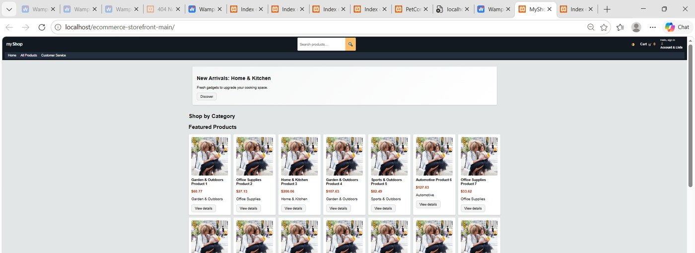
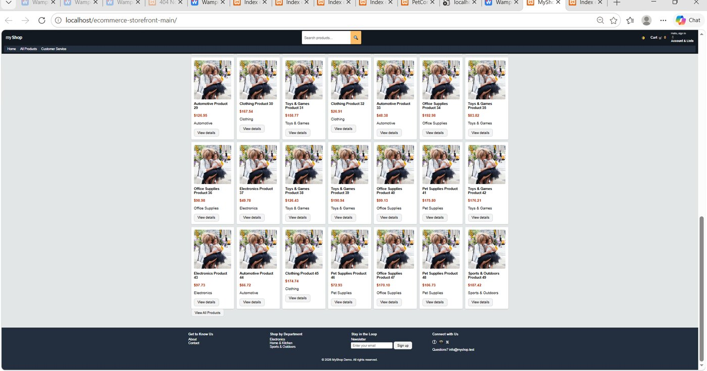
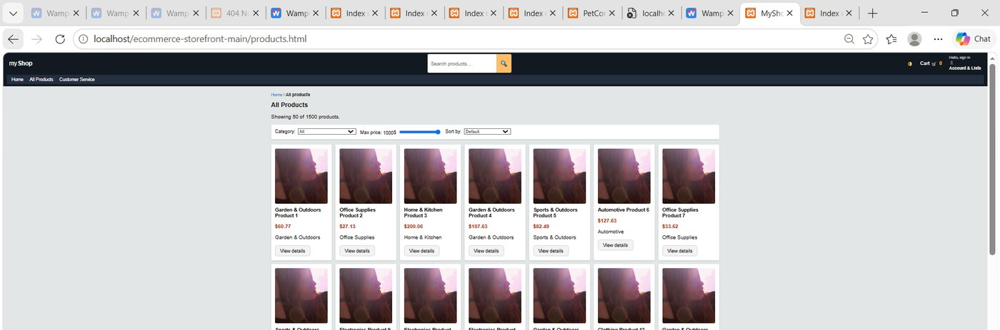
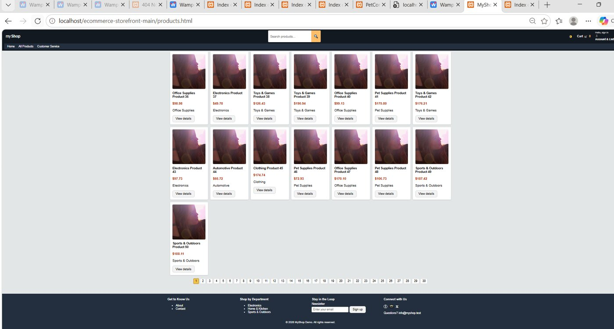
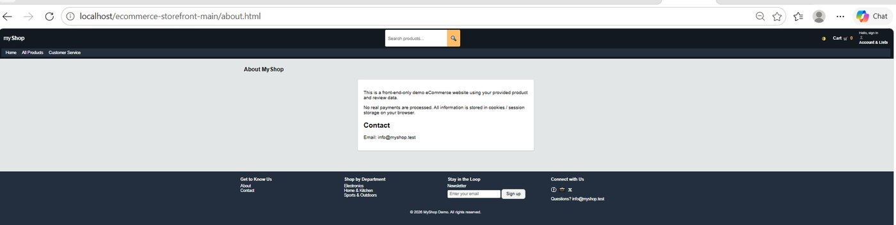
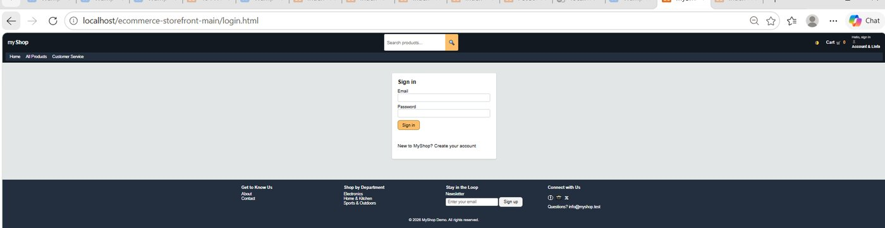
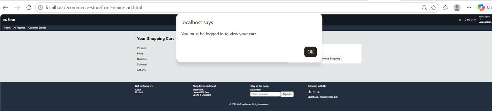

# MyShop E-Commerce Storefront

A multi-page e-commerce storefront built with HTML, CSS, JavaScript, jQuery, JSON, and XML. The application demonstrates product discovery, browser-based account state, cart management, checkout, and responsive interface design.

## Screenshots

<p align="center">
  <br>
  <b>Home Page and Featured Products</b>
</p>

<p align="center">
  <br>
  <b>Home Product Catalogue</b>
</p>

<p align="center">
  <br>
  <b>Products and Filtering</b>
</p>

<p align="center">
  <br>
  <b>Product Pagination</b>
</p>

<p align="center">
  <br>
  <b>About Page</b>
</p>

<p align="center">
  <br>
  <b>Login Page</b>
</p>

<p align="center">
  <br>
  <b>Cart Login Validation</b>
</p>

## Quick Start

HOW I START: IN WAMPOON HTDOCS, OPEN LOCAL HOST ON WAMPOON, OPEN ecommerce-storefront-main, RUNS

**Windows:** Download the repository ZIP, extract it, and double-click `start-demo.bat`. The site opens at `http://localhost:8000`.

**macOS/Linux:**

```bash
chmod +x start-demo.sh
./start-demo.sh
```

Press `Ctrl+C` in the terminal when finished.

## Features

- Product catalogue with category filtering and pagination
- Search suggestions and individual product pages
- Shopping cart with persistent browser storage
- Registration and login through a demonstration API
- Checkout and confirmation flow
- User profile page
- Product ratings and reviews
- Responsive layout and dark mode
- Product and category data loaded from JSON and XML

## Technologies

- HTML5
- CSS3
- JavaScript and jQuery
- AJAX
- JSON and XML
- Cookies and local storage

## Run Locally

Because the site loads local data files, serve it through a local web server rather than opening `index.html` directly.

```bash
python -m http.server 8000
```

Then visit `http://localhost:8000`.

## Important Note

Authentication uses the ReqRes demonstration API and is intended only to demonstrate front-end request handling. This is an educational project, not a production shopping service.

## What I Practiced

This project strengthened my skills in DOM manipulation, asynchronous requests, persistent client-side state, responsive design, structured data, reusable JavaScript, and multi-page navigation.
